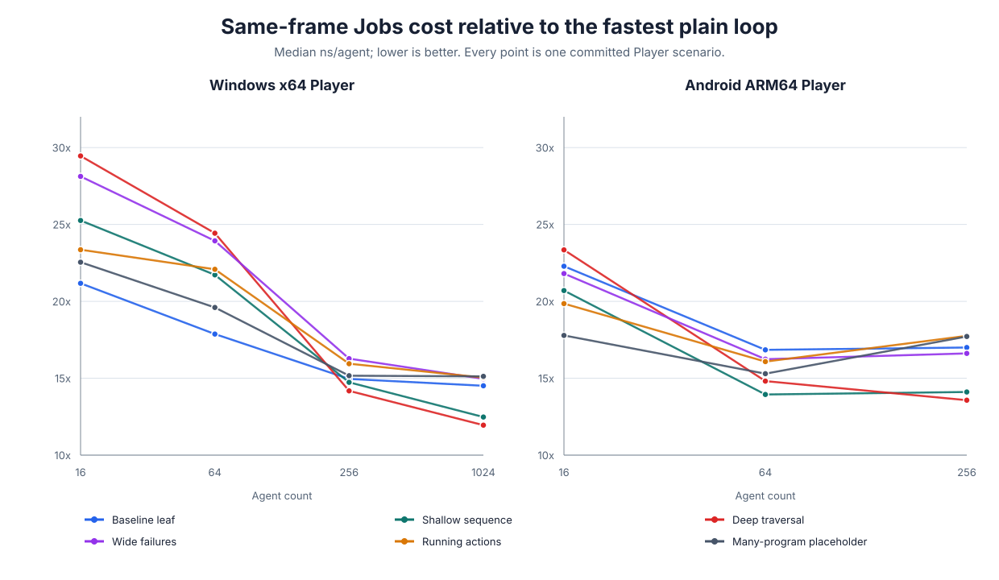

# Scheduling benchmark: Unity Jobs versus plain loops

This report packages the accepted Phase 4 measurements into one comparison. The headline result is
specific to the measured workloads: for six small built-in tree shapes and populations up to 1,024
agents, completing Unity Jobs in the same frame costs more per agent than running the same update in
an `Immediate` or `Budgeted` loop.



The chart contains all 42 comparable Player points: 24 Windows points (6 scenarios x 4 populations)
and 18 Android points (6 scenarios x 3 populations). For each point it divides the
`BatchedJobsSameFrame` median ns/agent by the lower median from `Immediate` and `Budgeted` for the
same platform, scenario and population. The ratio ranges from **11.95x to 29.46x on Windows** and
**13.57x to 23.34x on Android**. The committed [derived data and source hashes](../Planning~/Evidence/P7-024/derived-data.json)
make every plotted value traceable.

## What was measured

| Policy | Execution | Result latency | Player measurement in this report |
| --- | --- | --- | --- |
| `Immediate` | Plain loop, no Unity Jobs | Current frame | Windows, Android |
| `Budgeted` | Plain loop, no Unity Jobs; work may yield at the configured step limit | Configurable | Windows, Android |
| `BatchedJobsSameFrame` | Unity Jobs, scheduled in batches and completed by the caller | Current frame after completion | Windows, Android |
| `PipelinedJobs` | Unity Jobs with completion in a later phase | Next frame or explicit pipeline stage | **Not measured by the existing harness** |
| `Auto` | Chooses an existing policy; it is not another executor | Depends on selected policy and latency mode | Editor-only, same-frame selection comparison |

The authoritative latency and platform contracts remain in
[`execution-and-scheduling.md`](execution-and-scheduling.md) and the accepted
[`compatibility-matrix.md`](compatibility-matrix.md). Unity Web supports only its
single-thread `Immediate`/`Budgeted` forms, so this report does not imply worker-Job support there.

Each Player sample times one scheduler call over independent, already-created agents and reports
elapsed nanoseconds divided by agent count. Agent construction, disposal and serialization are
outside the timed window. Lower ns/agent means greater update throughput for this isolated call;
these measurements are not a complete frame-time or gameplay benchmark.

## A concrete workload

The deepest measured tree contains 63 nodes. Its medians show both the absolute cost and the way
same-frame Job overhead becomes less dominant as the population grows:

| Platform | Agents | Fastest plain policy | Plain median (ns/agent) | Same-frame Jobs median (ns/agent) | Ratio |
| --- | ---: | --- | ---: | ---: | ---: |
| Windows x64 Player | 16 | `Budgeted` | 12,575.00 | 370,418.75 | 29.46x |
| Windows x64 Player | 1,024 | `Immediate` | 12,437.99 | 148,613.57 | 11.95x |
| Android ARM64 Player | 16 | `Immediate` | 15,106.25 | 352,643.75 | 23.34x |
| Android ARM64 Player | 256 | `Immediate` | 15,146.09 | 205,607.42 | 13.57x |

Windows used a release IL2CPP/Burst Player on an Intel Core Ultra 9 275HX with 23 Job workers,
five warmups and fifteen measured samples at 16/64/256/1,024 agents. Android used a release
IL2CPP/Burst Player on one physical Google Pixel 10 Pro, three warmups and seven measured samples at
16/64/256 agents. Both used Unity 6000.5.8f1. The exact source files are the
[Windows Player JSON](../Benchmarks~/Phase4/Platform/Windows/Results/windows-player-scheduling-20260821.json)
and [Android Player JSON](../Benchmarks~/Phase4/Platform/Android/Results/android-player-scheduling-20260821.json).

## Auto does not remove the tradeoff

The existing same-frame Editor comparison selected a policy through `Auto` for 24 cases. It
underperformed the best measured fixed policy in **23 of 24** cases. In the cases where it selected
`BatchedJobsSameFrame`, the gap was **+188.30% to +1,773.99%**. Every selection had `Low`
confidence because the estimator was cold-started with one observation per case. These numbers come
from the canonical [Auto comparison JSON](../Benchmarks~/Phase4/AutoComparison/Results/auto-comparison-windows-editor-20260821.json);
they are Editor measurements and must not be mixed with the Player medians above.

## Interpretation and limits

The observed cost is consistent across x64 Windows and ARM64 Android: fixed Job scheduling,
coordination and same-frame completion overhead does not amortize for these small trees and measured
populations. The result supports choosing a plain loop for comparable work; it does not establish a
universal scheduling default or a performance threshold.

There is no committed `PipelinedJobs` benchmark in the Phase 4 harness. Its one-frame latency is an
intentional throughput tradeoff, but no speedup can be claimed from the existing data. The scenario
catalog also omits expensive custom Burst nodes, async work and a genuine many-program workload.
One Windows workstation and one Android device do not represent all hardware classes. These gaps are
kept visible instead of being filled with estimates or a new unreviewed benchmark run.

## Reproduce the figure

From the package root, use Python 3 with no third-party dependencies:

```powershell
python Planning~/Evidence/P7-024/generate_report_data.py --check
```

Omit `--check` to rebuild `derived-data.json` and the SVG from the three committed source JSON
files. The generator validates that every Player case contains exactly the three comparable fixed
policies before producing the chart.
